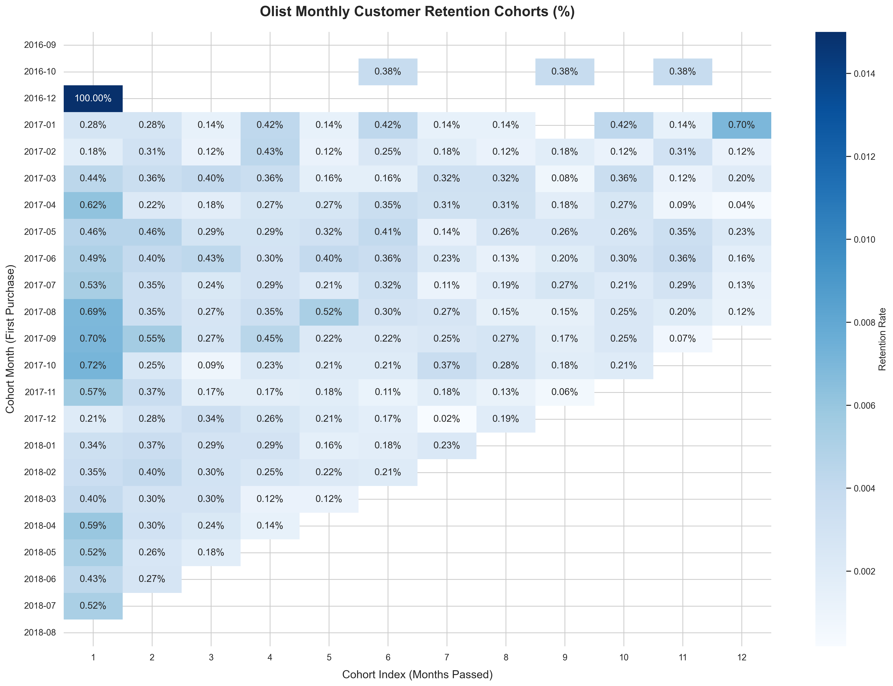

# 📊 Olist E-Commerce Analytics Platform


[](https://ecomprojectgit-546sw5cdmkkqffyltmbq7u.streamlit.app/)
[]()
[]()
[]()
[]()

> End-to-End Modern Data Stack (MDS) project for transforming, analyzing, and visualizing Brazilian e-commerce data.

> End-to-End Modern Data Stack (MDS) project for transforming, analyzing, and visualizing Brazilian e-commerce data using DuckDB, dbt, Python, and Streamlit.

---

## 🚀 Project Overview

This project demonstrates a complete analytics workflow built on the **Modern Data Stack (MDS)** paradigm. Raw transactional data from the Olist Brazilian E-Commerce dataset is transformed into business-ready analytical models, enriched with advanced customer analytics, and delivered through an interactive executive dashboard.

The platform enables stakeholders to monitor operational performance, evaluate customer retention, and identify high-value customer segments through data-driven insights.

---

## 🎯 Business Objectives

The project addresses three key business questions:

- How is the e-commerce operation performing across orders, revenue, and logistics?
- Which customer segments generate the highest business value?
- How effectively does the platform retain customers over time?

---

## 🏗️ Architecture

```text
                   ┌───────────────────┐
                   │   Raw CSV Files   │
                   └─────────┬─────────┘
                             │
                             ▼
                   ┌───────────────────┐
                   │      DuckDB       │
                   │ Data Warehouse    │
                   └─────────┬─────────┘
                             │
                             ▼
                   ┌───────────────────┐
                   │       dbt         │
                   │ Data Modeling     │
                   └─────────┬─────────┘
                             │
          ┌──────────────────┴──────────────────┐
          ▼                                     ▼
 ┌─────────────────┐                 ┌─────────────────┐
 │  RFM Analysis   │                 │ Cohort Analysis │
 │    (Python)     │                 │    (Python)     │
 └────────┬────────┘                 └────────┬────────┘
          └──────────────────┬───────────────┘
                             ▼
                  ┌─────────────────────┐
                  │ Streamlit Dashboard │
                  └─────────────────────┘
```

---

## 🛠️ Technology Stack

| Layer | Technology |
|---------|------------|
| Storage | DuckDB |
| Data Transformation | dbt Core |
| Data Processing | Python, Pandas, NumPy |
| Visualization | Plotly |
| Dashboard | Streamlit |
| Version Control | Git & GitHub |

---

## 📂 Project Structure

```text
ecom_project/
│
├── data/
│   ├── raw/
│   └── processed/
│
├── olist_pipeline/
│   ├── models/
│   │   ├── staging/
│   │   ├── intermediate/
│   │   └── marts/
│   │
│   ├── macros/
│   └── dbt_project.yml
│
├── analytics/
│   ├── rfm_analysis.py
│   ├── cohort_analysis.py
│   └── customer_segmentation.py
│
├── dashboard/
│   ├── pages/
│   └── components/
│
├── app.py
├── requirements.txt
└── README.md
```

---

## 📈 Key Analytics Modules

### 1. Operations & Logistics Analytics

Monitor:

- Revenue trends
- Order volume
- Order status distribution
- Delivery performance
- Regional logistics efficiency

#### Key Insight

Average delivery time is approximately **12 days**, with significant delays concentrated in several northern and northeastern states.

---

### 2. Customer Segmentation (RFM Analysis)

Customers are segmented using:

- **Recency** – How recently a customer purchased
- **Frequency** – How often a customer purchases
- **Monetary** – How much a customer spends

#### Generated Segments

- Champions
- Loyal Customers
- Potential Loyalists
- New Customers
- At-Risk Customers
- Lost Customers

#### Key Insight

The customer base is dominated by one-time and newly acquired buyers, while long-term loyal customers represent only a small portion of total users.

---

### 3. Cohort Retention Analysis

Monthly customer cohorts are tracked to evaluate retention behavior and repeat purchase patterns.

#### Key Insight

Retention drops sharply after the first month, indicating a transactional business model with limited recurring customer engagement.

This finding suggests that increasing customer retention may generate a higher return than continuously investing in acquisition campaigns.

---

## 📊 Dashboard Features

### Executive Overview

- KPI cards
- Revenue tracking
- Order monitoring
- Delivery metrics

### Customer Analytics

- Interactive RFM segmentation
- Segment distribution analysis
- Customer drill-down exploration

### Retention Analytics

- Cohort heatmaps
- Retention curves
- Customer lifecycle tracking

### User Experience

- Responsive layout
- Light/Dark mode support
- Interactive filtering
- Real-time visual exploration

---

## 📸 Dashboard Preview


```markdown



```


---

## ⚡ Getting Started

### 1. Clone Repository

```bash
git clone https://github.com/thanhgiang0607/ecom_project.git
cd ecom_project
```

### 2. Create Virtual Environment

```bash
python -m venv venv

# Windows
venv\Scripts\activate

# macOS / Linux
source venv/bin/activate
```

### 3. Install Dependencies

```bash
pip install -r requirements.txt
```

---

## 🔄 Run dbt Models

Navigate to the dbt project:

```bash
cd olist_pipeline
```

Verify configuration:

```bash
dbt debug
```

Build analytical models:

```bash
dbt run
```

Generate documentation:

```bash
dbt docs generate
dbt docs serve
```

---

## 📱 Launch Dashboard

Return to the project root directory:

```bash
streamlit run app.py
```

The dashboard will be available locally at:

```text
http://localhost:8501
```

---

## 📌 Key Outcomes

✅ Built a complete Modern Data Stack pipeline

✅ Implemented dimensional data modeling with dbt

✅ Developed customer segmentation using RFM methodology

✅ Performed cohort retention analysis

✅ Created an interactive executive dashboard

✅ Delivered actionable business insights from raw transactional data

---

## 🌐 Live Demo

Experience the deployed application here:

🚀 **Interactive Dashboard:**  
https://ecomprojectgit-546sw5cdmkkqffyltmbq7u.streamlit.app/

The dashboard is publicly hosted on Streamlit Community Cloud and provides access to:

- Executive KPI monitoring
- Revenue & logistics analytics
- RFM customer segmentation
- Cohort retention analysis
- Interactive filtering and drill-down exploration

No installation required — simply open the link and start exploring the insights.

---


## 👨‍💻 Author

**Thanh Giang Nguyen**

Data Analytics • Data Engineering • Business Intelligence • E-commerce • Data Visualization

GitHub: https://github.com/thanhgiang0607

---

⭐ If you find this project useful, consider giving it a star.